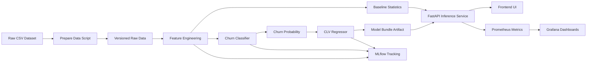

# Architecture Diagram

## Block summary

- `Prepare Data Script`: copies the source CSV into a reproducible raw-data location and creates a sample payload.
- `Feature Engineering`: derives churn-sensitive behavioral features.
- `Churn Classifier`: predicts probability of customer churn.
- `CLV Regressor`: predicts lifetime value using customer features and churn probability.
- `Model Bundle Artifact`: serialized inference package used by the API.
- `FastAPI Inference Service`: provides prediction, health, readiness, model info, and metrics endpoints.
- `Frontend UI`: standalone user interface that calls the backend through REST only.
- `Prometheus/Grafana`: production-style monitoring path for latency and request metrics.
- `MLflow`: tracks experiment metadata, parameters, metrics, and models.

